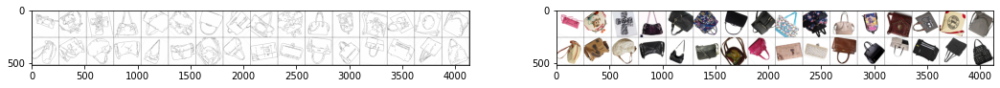
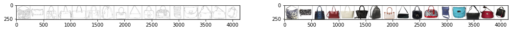
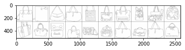
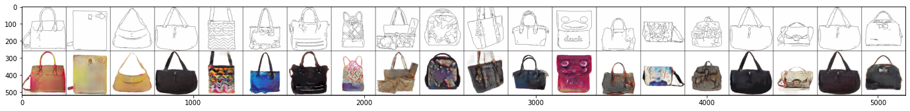

# Import packages

```python
import glob
from PIL import Image
from collections import OrderedDict
from sklearn.model_selection import train_test_split
import matplotlib.pyplot as plt

import torch
import torch.nn as nn
import torch.nn.functional as F
from torch.utils.data import Dataset, DataLoader

import torchvision
from torchvision import transforms
import torchvision.transforms.functional as TF

import pytorch_lightning as pl # pip install pytorch-lightning
from torchmetrics.functional import (psnr, ssim, accuracy) # pip install torchmetrics
from torchsummary import summary # pip install torchsummary
import segmentation_models_pytorch as smp # pip install segmentation-models-pytorch

print(f'Pytorch: {torch.__version__}')
print(f'Pytorch Vision: {torchvision.__version__}')
print(f'Pytorch Lightning: {pl.__version__}')
```

    Pytorch: 1.9.1+cu102
    Pytorch Vision: 0.10.1+cu102
    Pytorch Lightning: 1.4.7


# Hyperparameter


```python
DATASET_TRAIN_PATH = '/data/datasets/Pix2Pix/edges2handbags/train/'
DATASET_TEST_PATH = '/data/datasets/Pix2Pix/edges2handbags/test/'
TRAIN_BATCH_SIZE = 32
TRAIN_IMAGE_SIZE = 256
VAL_BATCH_SIZE = 16
VAL_IMAGE_SIZE = 256
TEST_BATCH_SIZE = 20
TEST_IMAGE_SIZE = 256
LAMBDA = 100
NUM_EPOCH = 100
AVAILABLE_GPUS = torch.cuda.device_count()
```

# Dataset and Dataloader

## Sketch Dataset


```python
class HorizontalSplit(torch.nn.Module):
    """
    Split the image in two, horizontally
    E.g. (1, 3, 256, 512) -> (2, 3, 256, 256) if the ratio is 0.5
    """
    def __init__(self, ratio=0.5):
        super(HorizontalSplit, self).__init__()
        self.ratio = ratio
    
    def forward(self, image):
        w, h = image.size
        idx = int(w * self.ratio)
        left = TF.crop(image, top=0, left=0, height=h, width=idx)
        right = TF.crop(image, top=0, left=idx, height=h, width=idx)
        return left, right      

class SketchDataset(Dataset):
    """
    Dataset class for Edges-to-RGB datasets such as edges2handbags and edges2shoes
    Download: http://efrosgans.eecs.berkeley.edu/pix2pix/datasets/
    """
    def __init__(self, filenames, split='train', transform=None):
        self.filenames = filenames
        self.split = split
        
        # Data transform
        if not transform:
            if self.split == 'train':
                self.transform = transforms.Compose([
                    HorizontalSplit(0.5),
                    transforms.Lambda(lambda images: torch.stack([transforms.ToTensor()(item) for item in images])),
                    transforms.CenterCrop((TRAIN_IMAGE_SIZE, TRAIN_IMAGE_SIZE)),
                    transforms.RandomVerticalFlip(),
                    transforms.RandomHorizontalFlip(),
                    transforms.RandomRotation(45, interpolation=torchvision.transforms.InterpolationMode.BILINEAR, fill=1),
                ])
            elif self.split == 'val':
                self.transform = transforms.Compose([
                    HorizontalSplit(0.5),
                    transforms.Lambda(lambda images: torch.stack([transforms.ToTensor()(item) for item in images])),
                    transforms.CenterCrop((VAL_IMAGE_SIZE, VAL_IMAGE_SIZE)),
                ])
            else:
                self.transform = transforms.Compose([
                    HorizontalSplit(0.5),
                    transforms.Lambda(lambda images: torch.stack([transforms.ToTensor()(item) for item in images])),
                ])
        else:
            self.transform = transform

    def __len__(self):
        return len(self.filenames)
    
    def __getitem__(self, idx):
        image = Image.open(self.filenames[idx])
        image = self.transform(image)
        image, target = torch.split(image, 1)
        image = torch.squeeze(image)
        # Convert image (edges) to real grayscale e.g. 1-D
        image = TF.rgb_to_grayscale(image)
        target = torch.squeeze(target)
        return image, target
```


```python
# Load filenames and split
filenames = sorted(glob.glob(f'{DATASET_TRAIN_PATH}/*.jpg'))
train_filenames, val_filenames = train_test_split(filenames, test_size=0.1)
print(f'Train dataset: {len(train_filenames)} - Validation dataset: {len(val_filenames)}')
```

    Train dataset: 124710 - Validation dataset: 13857


## Dataset Visualisation


```python
# Training dataset and datalaoder
train_dataset = SketchDataset(train_filenames, split='train')
train_dataloader = DataLoader(train_dataset, batch_size=TRAIN_BATCH_SIZE, num_workers=16, shuffle=True, drop_last=True)

fig, (ax1, ax2) = plt.subplots(1, 2, figsize=(18, 18))

data = next(iter(train_dataloader))
image, target = data

grid_image = torchvision.utils.make_grid(image, nrow=16)
ax1.imshow(grid_image.permute(1, 2, 0))
grid_image = torchvision.utils.make_grid(target, nrow=16)
ax2.imshow(grid_image.permute(1, 2, 0))
```


    

```python
# Validation dataset and dataloader
val_dataset = SketchDataset(val_filenames, split='val')
val_dataloader = DataLoader(val_dataset, batch_size=VAL_BATCH_SIZE, num_workers=8, shuffle=False)

fig, (ax1, ax2) = plt.subplots(1, 2, figsize=(18, 18))

data = next(iter(val_dataloader))
image, target = data
grid_image = torchvision.utils.make_grid(image, nrow=16)
ax1.imshow(grid_image.permute(1, 2, 0))
grid_image = torchvision.utils.make_grid(target, nrow=16)
ax2.imshow(grid_image.permute(1, 2, 0))
```
    

    

```python
test_filenames = sorted(glob.glob(f'{DATASET_TEST_PATH}/*.jpg'))
test_dataset = SketchDataset(test_filenames, split='test')
test_dataloader = DataLoader(test_dataset, batch_size=TEST_BATCH_SIZE, shuffle=False)

data = next(iter(test_dataloader))
image, target = data
grid_image = torchvision.utils.make_grid(image, nrow=10)
plt.imshow(grid_image.permute(1, 2, 0))
```
    

    

# Models

## Generator


```python
class Generator(nn.Module):
    def __init__(self, dropout_p=0.4):
        super(Generator, self).__init__()
        self.dropout_p = dropout_p
        # Load Unet with Resnet34 Embedding from SMP library. Pre-trained on Imagenet
        self.unet = smp.Unet(encoder_name="resnet34", encoder_weights="imagenet", 
                             in_channels=1, classes=3, activation=None)
        # Adding two layers of Dropout as the original Unet doesn't have any
        # This will be used to feed noise into the networking during both training and evaluation
        # These extra layers will be added on decoder part where 2D transposed convolution is occured
        for idx in range(1, 3):
            self.unet.decoder.blocks[idx].conv1.add_module('3', nn.Dropout2d(p=self.dropout_p))
        # Disabling in-place ReLU as to avoid in-place operations as it will
        # cause issues for double backpropagation on the same graph
        for module in self.unet.modules():
            if isinstance(module, nn.ReLU):
                module.inplace = False

    def forward(self, x):
        x = self.unet(x)
        x = F.relu(x)
        return x
```


```python
generator = Generator()
summary(generator, input_size=(1, 256, 256), device='cpu')
```

    ----------------------------------------------------------------
            Layer (type)               Output Shape         Param #
    ================================================================
                Conv2d-1         [-1, 64, 128, 128]           3,136
           BatchNorm2d-2         [-1, 64, 128, 128]             128
                  ReLU-3         [-1, 64, 128, 128]               0
             MaxPool2d-4           [-1, 64, 64, 64]               0
                Conv2d-5           [-1, 64, 64, 64]          36,864
           BatchNorm2d-6           [-1, 64, 64, 64]             128
                  ReLU-7           [-1, 64, 64, 64]               0
                Conv2d-8           [-1, 64, 64, 64]          36,864
           BatchNorm2d-9           [-1, 64, 64, 64]             128
                 ReLU-10           [-1, 64, 64, 64]               0
           BasicBlock-11           [-1, 64, 64, 64]               0
               Conv2d-12           [-1, 64, 64, 64]          36,864
          BatchNorm2d-13           [-1, 64, 64, 64]             128
                 ReLU-14           [-1, 64, 64, 64]               0
               Conv2d-15           [-1, 64, 64, 64]          36,864
          BatchNorm2d-16           [-1, 64, 64, 64]             128
                 ReLU-17           [-1, 64, 64, 64]               0
           BasicBlock-18           [-1, 64, 64, 64]               0
               Conv2d-19           [-1, 64, 64, 64]          36,864
          BatchNorm2d-20           [-1, 64, 64, 64]             128
                 ReLU-21           [-1, 64, 64, 64]               0
               Conv2d-22           [-1, 64, 64, 64]          36,864
          BatchNorm2d-23           [-1, 64, 64, 64]             128
                 ReLU-24           [-1, 64, 64, 64]               0
           BasicBlock-25           [-1, 64, 64, 64]               0
               Conv2d-26          [-1, 128, 32, 32]          73,728
          BatchNorm2d-27          [-1, 128, 32, 32]             256
                 ReLU-28          [-1, 128, 32, 32]               0
               Conv2d-29          [-1, 128, 32, 32]         147,456
          BatchNorm2d-30          [-1, 128, 32, 32]             256
               Conv2d-31          [-1, 128, 32, 32]           8,192
          BatchNorm2d-32          [-1, 128, 32, 32]             256
                 ReLU-33          [-1, 128, 32, 32]               0
           BasicBlock-34          [-1, 128, 32, 32]               0
               Conv2d-35          [-1, 128, 32, 32]         147,456
          BatchNorm2d-36          [-1, 128, 32, 32]             256
                 ReLU-37          [-1, 128, 32, 32]               0
               Conv2d-38          [-1, 128, 32, 32]         147,456
          BatchNorm2d-39          [-1, 128, 32, 32]             256
                 ReLU-40          [-1, 128, 32, 32]               0
           BasicBlock-41          [-1, 128, 32, 32]               0
               Conv2d-42          [-1, 128, 32, 32]         147,456
          BatchNorm2d-43          [-1, 128, 32, 32]             256
                 ReLU-44          [-1, 128, 32, 32]               0
               Conv2d-45          [-1, 128, 32, 32]         147,456
          BatchNorm2d-46          [-1, 128, 32, 32]             256
                 ReLU-47          [-1, 128, 32, 32]               0
           BasicBlock-48          [-1, 128, 32, 32]               0
               Conv2d-49          [-1, 128, 32, 32]         147,456
          BatchNorm2d-50          [-1, 128, 32, 32]             256
                 ReLU-51          [-1, 128, 32, 32]               0
               Conv2d-52          [-1, 128, 32, 32]         147,456
          BatchNorm2d-53          [-1, 128, 32, 32]             256
                 ReLU-54          [-1, 128, 32, 32]               0
           BasicBlock-55          [-1, 128, 32, 32]               0
               Conv2d-56          [-1, 256, 16, 16]         294,912
          BatchNorm2d-57          [-1, 256, 16, 16]             512
                 ReLU-58          [-1, 256, 16, 16]               0
               Conv2d-59          [-1, 256, 16, 16]         589,824
          BatchNorm2d-60          [-1, 256, 16, 16]             512
               Conv2d-61          [-1, 256, 16, 16]          32,768
          BatchNorm2d-62          [-1, 256, 16, 16]             512
                 ReLU-63          [-1, 256, 16, 16]               0
           BasicBlock-64          [-1, 256, 16, 16]               0
               Conv2d-65          [-1, 256, 16, 16]         589,824
          BatchNorm2d-66          [-1, 256, 16, 16]             512
                 ReLU-67          [-1, 256, 16, 16]               0
               Conv2d-68          [-1, 256, 16, 16]         589,824
          BatchNorm2d-69          [-1, 256, 16, 16]             512
                 ReLU-70          [-1, 256, 16, 16]               0
           BasicBlock-71          [-1, 256, 16, 16]               0
               Conv2d-72          [-1, 256, 16, 16]         589,824
          BatchNorm2d-73          [-1, 256, 16, 16]             512
                 ReLU-74          [-1, 256, 16, 16]               0
               Conv2d-75          [-1, 256, 16, 16]         589,824
          BatchNorm2d-76          [-1, 256, 16, 16]             512
                 ReLU-77          [-1, 256, 16, 16]               0
           BasicBlock-78          [-1, 256, 16, 16]               0
               Conv2d-79          [-1, 256, 16, 16]         589,824
          BatchNorm2d-80          [-1, 256, 16, 16]             512
                 ReLU-81          [-1, 256, 16, 16]               0
               Conv2d-82          [-1, 256, 16, 16]         589,824
          BatchNorm2d-83          [-1, 256, 16, 16]             512
                 ReLU-84          [-1, 256, 16, 16]               0
           BasicBlock-85          [-1, 256, 16, 16]               0
               Conv2d-86          [-1, 256, 16, 16]         589,824
          BatchNorm2d-87          [-1, 256, 16, 16]             512
                 ReLU-88          [-1, 256, 16, 16]               0
               Conv2d-89          [-1, 256, 16, 16]         589,824
          BatchNorm2d-90          [-1, 256, 16, 16]             512
                 ReLU-91          [-1, 256, 16, 16]               0
           BasicBlock-92          [-1, 256, 16, 16]               0
               Conv2d-93          [-1, 256, 16, 16]         589,824
          BatchNorm2d-94          [-1, 256, 16, 16]             512
                 ReLU-95          [-1, 256, 16, 16]               0
               Conv2d-96          [-1, 256, 16, 16]         589,824
          BatchNorm2d-97          [-1, 256, 16, 16]             512
                 ReLU-98          [-1, 256, 16, 16]               0
           BasicBlock-99          [-1, 256, 16, 16]               0
              Conv2d-100            [-1, 512, 8, 8]       1,179,648
         BatchNorm2d-101            [-1, 512, 8, 8]           1,024
                ReLU-102            [-1, 512, 8, 8]               0
              Conv2d-103            [-1, 512, 8, 8]       2,359,296
         BatchNorm2d-104            [-1, 512, 8, 8]           1,024
              Conv2d-105            [-1, 512, 8, 8]         131,072
         BatchNorm2d-106            [-1, 512, 8, 8]           1,024
                ReLU-107            [-1, 512, 8, 8]               0
          BasicBlock-108            [-1, 512, 8, 8]               0
              Conv2d-109            [-1, 512, 8, 8]       2,359,296
         BatchNorm2d-110            [-1, 512, 8, 8]           1,024
                ReLU-111            [-1, 512, 8, 8]               0
              Conv2d-112            [-1, 512, 8, 8]       2,359,296
         BatchNorm2d-113            [-1, 512, 8, 8]           1,024
                ReLU-114            [-1, 512, 8, 8]               0
          BasicBlock-115            [-1, 512, 8, 8]               0
              Conv2d-116            [-1, 512, 8, 8]       2,359,296
         BatchNorm2d-117            [-1, 512, 8, 8]           1,024
                ReLU-118            [-1, 512, 8, 8]               0
              Conv2d-119            [-1, 512, 8, 8]       2,359,296
         BatchNorm2d-120            [-1, 512, 8, 8]           1,024
                ReLU-121            [-1, 512, 8, 8]               0
          BasicBlock-122            [-1, 512, 8, 8]               0
       ResNetEncoder-123  [[-1, 1, 256, 256], [-1, 64, 128, 128], [-1, 64, 64, 64], [-1, 128, 32, 32], [-1, 256, 16, 16], [-1, 512, 8, 8]]               0
            Identity-124            [-1, 512, 8, 8]               0
            Identity-125          [-1, 768, 16, 16]               0
           Attention-126          [-1, 768, 16, 16]               0
              Conv2d-127          [-1, 256, 16, 16]       1,769,472
         BatchNorm2d-128          [-1, 256, 16, 16]             512
                ReLU-129          [-1, 256, 16, 16]               0
              Conv2d-130          [-1, 256, 16, 16]         589,824
         BatchNorm2d-131          [-1, 256, 16, 16]             512
                ReLU-132          [-1, 256, 16, 16]               0
            Identity-133          [-1, 256, 16, 16]               0
           Attention-134          [-1, 256, 16, 16]               0
        DecoderBlock-135          [-1, 256, 16, 16]               0
            Identity-136          [-1, 384, 32, 32]               0
           Attention-137          [-1, 384, 32, 32]               0
              Conv2d-138          [-1, 128, 32, 32]         442,368
         BatchNorm2d-139          [-1, 128, 32, 32]             256
                ReLU-140          [-1, 128, 32, 32]               0
           Dropout2d-141          [-1, 128, 32, 32]               0
              Conv2d-142          [-1, 128, 32, 32]         147,456
         BatchNorm2d-143          [-1, 128, 32, 32]             256
                ReLU-144          [-1, 128, 32, 32]               0
            Identity-145          [-1, 128, 32, 32]               0
           Attention-146          [-1, 128, 32, 32]               0
        DecoderBlock-147          [-1, 128, 32, 32]               0
            Identity-148          [-1, 192, 64, 64]               0
           Attention-149          [-1, 192, 64, 64]               0
              Conv2d-150           [-1, 64, 64, 64]         110,592
         BatchNorm2d-151           [-1, 64, 64, 64]             128
                ReLU-152           [-1, 64, 64, 64]               0
           Dropout2d-153           [-1, 64, 64, 64]               0
              Conv2d-154           [-1, 64, 64, 64]          36,864
         BatchNorm2d-155           [-1, 64, 64, 64]             128
                ReLU-156           [-1, 64, 64, 64]               0
            Identity-157           [-1, 64, 64, 64]               0
           Attention-158           [-1, 64, 64, 64]               0
        DecoderBlock-159           [-1, 64, 64, 64]               0
            Identity-160        [-1, 128, 128, 128]               0
           Attention-161        [-1, 128, 128, 128]               0
              Conv2d-162         [-1, 32, 128, 128]          36,864
         BatchNorm2d-163         [-1, 32, 128, 128]              64
                ReLU-164         [-1, 32, 128, 128]               0
              Conv2d-165         [-1, 32, 128, 128]           9,216
         BatchNorm2d-166         [-1, 32, 128, 128]              64
                ReLU-167         [-1, 32, 128, 128]               0
            Identity-168         [-1, 32, 128, 128]               0
           Attention-169         [-1, 32, 128, 128]               0
        DecoderBlock-170         [-1, 32, 128, 128]               0
              Conv2d-171         [-1, 16, 256, 256]           4,608
         BatchNorm2d-172         [-1, 16, 256, 256]              32
                ReLU-173         [-1, 16, 256, 256]               0
              Conv2d-174         [-1, 16, 256, 256]           2,304
         BatchNorm2d-175         [-1, 16, 256, 256]              32
                ReLU-176         [-1, 16, 256, 256]               0
            Identity-177         [-1, 16, 256, 256]               0
           Attention-178         [-1, 16, 256, 256]               0
        DecoderBlock-179         [-1, 16, 256, 256]               0
         UnetDecoder-180         [-1, 16, 256, 256]               0
              Conv2d-181          [-1, 3, 256, 256]             435
            Identity-182          [-1, 3, 256, 256]               0
            Identity-183          [-1, 3, 256, 256]               0
          Activation-184          [-1, 3, 256, 256]               0
                Unet-185          [-1, 3, 256, 256]               0
    ================================================================
    Total params: 24,430,387
    Trainable params: 24,430,387
    Non-trainable params: 0
    ----------------------------------------------------------------
    Input size (MB): 0.25
    Forward/backward pass size (MB): 337.00
    Params size (MB): 93.19
    Estimated Total Size (MB): 430.44
    ----------------------------------------------------------------


## Discriminator


```python
class Discriminator(nn.Module):
    def __init__(self, dropout_p=0.4):
        super(Discriminator, self).__init__()
        self.dropout_p = dropout_p
        self.model = nn.Sequential(OrderedDict([
          ('conv1', nn.Conv2d(4, 128, 3, stride=2, padding=2)),
          ('bn1', nn.BatchNorm2d(128)),
          ('relu1', nn.ReLU()),
          ('conv2', nn.Conv2d(128, 256, 3, stride=2, padding=2)),
          ('bn2', nn.BatchNorm2d(256)),
          ('relu2', nn.ReLU()),
          ('conv3', nn.Conv2d(256, 512, 3)),
          ('dropout3', nn.Dropout2d(p=self.dropout_p)),
          ('bn3', nn.BatchNorm2d(512)),
          ('relu3', nn.ReLU()),
          ('conv4', nn.Conv2d(512, 1024, 3)),
          ('dropout4', nn.Dropout2d(p=self.dropout_p)),
          ('bn4', nn.BatchNorm2d(1024)),
          ('relu4', nn.ReLU()),
          ('conv5', nn.Conv2d(1024, 512, 3, stride=2, padding=2)),
          ('dropout5', nn.Dropout2d(p=self.dropout_p)),
          ('bn5', nn.BatchNorm2d(512)),
          ('relu5', nn.ReLU()),
          ('conv6', nn.Conv2d(512, 256, 3, stride=2, padding=2)),
          ('dropout6', nn.Dropout2d(p=self.dropout_p)),
          ('bn6', nn.BatchNorm2d(256)),
          ('relu6', nn.ReLU()),
          ('conv7', nn.Conv2d(256, 128, 3)),
          ('bn7', nn.BatchNorm2d(128)),
          ('relu7', nn.ReLU()),
          ('conv8', nn.Conv2d(128, 1, 3)),
        ]))

    def forward(self, x):
        # Input: {Grayscale image, RGB target} concatenated along the channel-axis
        x = self.model(x)
        x = F.sigmoid(x)
        return  x
```


```python
discriminator = Discriminator()
summary(discriminator, input_size=(4, 256, 256), device='cpu')
```

    ----------------------------------------------------------------
            Layer (type)               Output Shape         Param #
    ================================================================
                Conv2d-1        [-1, 128, 129, 129]           4,736
           BatchNorm2d-2        [-1, 128, 129, 129]             256
                  ReLU-3        [-1, 128, 129, 129]               0
                Conv2d-4          [-1, 256, 66, 66]         295,168
           BatchNorm2d-5          [-1, 256, 66, 66]             512
                  ReLU-6          [-1, 256, 66, 66]               0
                Conv2d-7          [-1, 512, 64, 64]       1,180,160
             Dropout2d-8          [-1, 512, 64, 64]               0
           BatchNorm2d-9          [-1, 512, 64, 64]           1,024
                 ReLU-10          [-1, 512, 64, 64]               0
               Conv2d-11         [-1, 1024, 62, 62]       4,719,616
            Dropout2d-12         [-1, 1024, 62, 62]               0
          BatchNorm2d-13         [-1, 1024, 62, 62]           2,048
                 ReLU-14         [-1, 1024, 62, 62]               0
               Conv2d-15          [-1, 512, 32, 32]       4,719,104
            Dropout2d-16          [-1, 512, 32, 32]               0
          BatchNorm2d-17          [-1, 512, 32, 32]           1,024
                 ReLU-18          [-1, 512, 32, 32]               0
               Conv2d-19          [-1, 256, 17, 17]       1,179,904
            Dropout2d-20          [-1, 256, 17, 17]               0
          BatchNorm2d-21          [-1, 256, 17, 17]             512
                 ReLU-22          [-1, 256, 17, 17]               0
               Conv2d-23          [-1, 128, 15, 15]         295,040
          BatchNorm2d-24          [-1, 128, 15, 15]             256
                 ReLU-25          [-1, 128, 15, 15]               0
               Conv2d-26            [-1, 1, 13, 13]           1,153
    ================================================================
    Total params: 12,400,513
    Trainable params: 12,400,513
    Non-trainable params: 0
    ----------------------------------------------------------------
    Input size (MB): 1.00
    Forward/backward pass size (MB): 277.32
    Params size (MB): 47.30
    Estimated Total Size (MB): 325.62
    ----------------------------------------------------------------


    /opt/conda/lib/python3.7/site-packages/torch/nn/functional.py:1805: UserWarning: nn.functional.sigmoid is deprecated. Use torch.sigmoid instead.
      warnings.warn("nn.functional.sigmoid is deprecated. Use torch.sigmoid instead.")


## Pix2Pix (Generative Adversarial Networks)


```python
class Pix2Pix(pl.LightningModule):
    def __init__(self, generator_dropout_p=0.4, discriminator_dropout_p=0.4, generator_lr=1e-3, discriminator_lr=1e-6, 
                 weight_decay=1e-5, lr_scheduler_T_0=1e3, lr_scheduler_T_mult=2):
        super(Pix2Pix, self).__init__()
        self.save_hyperparameters()
        # Important to disable automatic optimization as it 
        # will be done manually as there are two optimizators
        self.automatic_optimization = False
        self.generator_lr = generator_lr               # Generator learning rate
        self.discriminator_lr = discriminator_lr       # Discriminator learning rate
        self.weight_decay = weight_decay               # Weight decay e.g. L2 regularization
        self.lr_scheduler_T_0 = lr_scheduler_T_0       # Optimizer initial restart step number
        self.lr_scheduler_T_mult = lr_scheduler_T_mult # Optimizer restart step number factor
        
        # Models
        self.generator = Generator(dropout_p=generator_dropout_p)
        self.discriminator = Discriminator(dropout_p=discriminator_dropout_p)

    def forward(self, x):
        return self.generator(x)
    
    def generator_loss(self, prediction_image, target_image, prediction_label, target_label):
        """
        Generator loss (a combination of): 
            1 - Binary Cross-Entropy
                Between predicted labels (generated by the discriminator) and target labels which is all 1s
            2 - L1 / Mean Absolute Error (weighted by lambda)
                Between generated image and target image
            3 - L2 / Mean Squared Error (weighted by lambda)
                Between generated image and target image
        """
        bce_loss = F.binary_cross_entropy(prediction_label, target_label)
        l1_loss = F.l1_loss(prediction_image, target_image)
        mse_loss = F.mse_loss(prediction_image, target_image)
        return bce_loss, l1_loss, mse_loss
    
    def discriminator_loss(self, prediction_label, target_label):
        """
        Discriminator loss: 
            1 - Binary Cross-Entropy
                Between predicted labels (generated by the discriminator) and target labels
                The target would be all 0s if the input of the discriminator is the generated image (generator)
                The target would be all 1s if the input of the discriminator is the target image (dataloader)
        """
        bce_loss = F.binary_cross_entropy(prediction_label, target_label)
        return bce_loss
    
    def configure_optimizers(self):
        """
        Using Adam optimizer for both generator and discriminator including L2 regularization
        Both would have different initial learning rates
        Stochastic Gradient Descent with Warm Restarts is also added as learning scheduler (https://arxiv.org/abs/1608.03983)
        """
        # Optimizers
        generator_optimizer = torch.optim.Adam(self.generator.parameters(), lr=self.generator_lr, weight_decay=self.weight_decay)
        discriminator_optimizer = torch.optim.Adam(self.discriminator.parameters(), lr=self.discriminator_lr, weight_decay=self.weight_decay)
        # Learning Scheduler
        genertator_lr_scheduler = torch.optim.lr_scheduler.CosineAnnealingWarmRestarts(generator_optimizer, T_0=self.lr_scheduler_T_0, T_mult=self.lr_scheduler_T_mult)
        discriminator_lr_scheduler = torch.optim.lr_scheduler.CosineAnnealingWarmRestarts(discriminator_optimizer, T_0=self.lr_scheduler_T_0, T_mult=self.lr_scheduler_T_mult)
        return [generator_optimizer, discriminator_optimizer], [genertator_lr_scheduler, discriminator_lr_scheduler]

    def training_step(self, batch, batch_idx):
        # Optimizers
        generator_optimizer, discriminator_optimizer = self.optimizers()
        generator_lr_scheduler, discriminator_lr_scheduler = self.lr_schedulers()
        
        image, target = batch
        image_i, image_j = torch.split(image, TRAIN_BATCH_SIZE // 2)
        target_i, target_j = torch.split(target, TRAIN_BATCH_SIZE // 2)
        
        ######################################
        #  Discriminator Loss and Optimizer  #
        ######################################
        # Generator Feed-Forward
        generator_prediction = self.forward(image_i)
        generator_prediction = torch.clip(generator_prediction, 0, 1)
        # Discriminator Feed-Forward
        discriminator_prediction_real = self.discriminator(torch.cat((image_i, target_i), dim=1))
        discriminator_prediction_fake = self.discriminator(torch.cat((image_i, generator_prediction), dim=1))
        # Discriminator Loss
        discriminator_label_real = self.discriminator_loss(discriminator_prediction_real, 
                                                           torch.ones_like(discriminator_prediction_real))
        discriminator_label_fake = self.discriminator_loss(discriminator_prediction_fake,
                                                           torch.zeros_like(discriminator_prediction_fake))
        discriminator_loss = discriminator_label_real + discriminator_label_fake
        # Discriminator Optimizer
        discriminator_optimizer.zero_grad()
        discriminator_loss.backward()
        discriminator_optimizer.step()
        discriminator_lr_scheduler.step()
        
        ##################################
        #  Generator Loss and Optimizer  #
        ##################################
        #  Generator Feed-Forward
        generator_prediction = self.forward(image_j)
        generator_prediction = torch.clip(generator_prediction, 0, 1)
        # Discriminator Feed-Forward
        discriminator_prediction_fake = self.discriminator(torch.cat((image_j, generator_prediction), dim=1))
        # Generator loss
        generator_bce_loss, generator_l1_loss, generator_mse_loss = self.generator_loss(generator_prediction, target_j,
                                                                                        discriminator_prediction_fake,
                                                                                        torch.ones_like(discriminator_prediction_fake))
        generator_loss = generator_bce_loss + (generator_l1_loss * LAMBDA) + (generator_mse_loss * LAMBDA)
        # Generator Optimizer
        generator_optimizer.zero_grad()
        generator_loss.backward()
        generator_optimizer.step()
        generator_lr_scheduler.step()
        
        # Progressbar and Logging
        loss = OrderedDict({'train_g_bce_loss': generator_bce_loss, 'train_g_l1_loss': generator_l1_loss, 'train_g_mse_loss': generator_mse_loss,
                            'train_g_loss': generator_loss, 'train_d_loss': discriminator_loss,
                            'train_g_lr': generator_lr_scheduler.get_last_lr()[0], 'train_d_lr': discriminator_lr_scheduler.get_last_lr()[0]})
        self.log_dict(loss, prog_bar=True)
        return loss
    
    def validation_step(self, batch, batch_idx):
        image, target = batch
        
        # Generator Feed-Forward
        generator_prediction = self.forward(image)
        generator_prediction = torch.clip(generator_prediction, 0, 1)
        # Generator Metrics
        generator_psnr = psnr(generator_prediction, target)
        generator_ssim = ssim(generator_prediction, target)
        discriminator_prediction_fake = self.discriminator(torch.cat((image, generator_prediction), dim=1))
        generator_accuracy = accuracy(discriminator_prediction_fake, torch.ones_like(discriminator_prediction_fake, dtype=torch.int32))
        
        # Discriminator Feed-Forward
        discriminator_prediction_real = self.discriminator(torch.cat((image, target), dim=1))
        discriminator_prediction_fake = self.discriminator(torch.cat((image, generator_prediction), dim=1))
        # Discriminator Metrics
        discriminator_accuracy = accuracy(discriminator_prediction_real, torch.ones_like(discriminator_prediction_real, dtype=torch.int32)) * 0.5 + \
                                accuracy(discriminator_prediction_fake, torch.zeros_like(discriminator_prediction_fake, dtype=torch.int32)) * 0.5
            
        # Progressbar and Logging
        metrics = OrderedDict({'val_g_psnr': generator_psnr, 'val_g_ssim': generator_ssim,
                               'val_g_accuracy': generator_accuracy, 'val_d_accuracy': discriminator_accuracy})
        
        self.log_dict(metrics, prog_bar=True)
        return metrics
```

# Callbacks


```python
class EpochInference(pl.callbacks.base.Callback):
    """
    Callback on each end of training epoch
    The callback will do inference on test dataloader based on corresponding checkpoints
    The results will be saved as an image with 4-rows:
        1 - Input image e.g. grayscale edged input
        2 - Ground-truth
        3 - Single inference
        4 - Mean of hundred accumulated inference
    Note that the inference have a noise factor that will generate different output on each execution
    """
    def __init__(self, dataloader, *args, **kwargs):
        super(EpochInference, self).__init__(*args, **kwargs)
        self.dataloader = dataloader
        
    def on_train_epoch_end(self, trainer, pl_module):
        super(EpochInference, self).on_train_epoch_end(trainer, pl_module)
        data = next(iter(self.dataloader))
        image, target = data
        image = image.cuda()
        target = target.cuda()
        with torch.no_grad():
            # Take average of multiple inference as there is a random noise
            # Single
            reconstruction_init = pl_module.forward(image)
            reconstruction_init = torch.clip(reconstruction_init, 0, 1)
            # Mean
            reconstruction_mean = torch.stack([pl_module.forward(image) for _ in range(100)])
            reconstruction_mean = torch.clip(reconstruction_mean, 0, 1)
            reconstruction_mean = torch.mean(reconstruction_mean, dim=0)
        # Grayscale 1-D to 3-D
        image = torch.stack([image for _ in range(3)], dim=1)
        image = torch.squeeze(image)
        grid_image = torchvision.utils.make_grid(torch.cat([image, target, reconstruction_init, reconstruction_mean], dim=0), nrow=20)
        torchvision.utils.save_image(grid_image, fp=f'{trainer.log_dir}/epoch-{trainer.current_epoch:04}.png')
```

# Training


```python
epoch_inference_callback = EpochInference(test_dataloader)
checkpoint_callback = pl.callbacks.model_checkpoint.ModelCheckpoint()

model = Pix2Pix(generator_dropout_p=0.4, discriminator_dropout_p=0.25,
                generator_lr=1e-3, discriminator_lr=1e-5, 
                lr_scheduler_T_0=len(train_dataloader) * 2)

trainer = pl.Trainer(gpus=1, max_epochs=NUM_EPOCH, val_check_interval=0.5, default_root_dir='./pix2pix/', 
                     callbacks=[epoch_inference_callback, checkpoint_callback])
trainer.fit(model, train_dataloader, val_dataloader)
```

# Evaluation

## Load model


```python
checkpoint = sorted(glob.glob('./pix2pix/checkpoints/*.ckpt'), key=os.path.getmtime)[0]
checkpoint = torch.load(checkpoint)
model = Pix2Pix()
model.load_state_dict(checkpoint['state_dict'], strict=True)
```

```python
data = next(iter(test_dataloader))
image, _ = data
with torch.no_grad():
    reconstruction = model(image)
    reconstruction = torch.clip(reconstruction, 0, 1)

image = torch.stack([image for _ in range(3)], dim=1)
image = torch.squeeze(image)
grid_image = torchvision.utils.make_grid(torch.cat([image, reconstruction]), nrow=20)
plt.figure(figsize=(24, 24))
plt.imshow(grid_image.permute(1, 2, 0))
```
    

    

